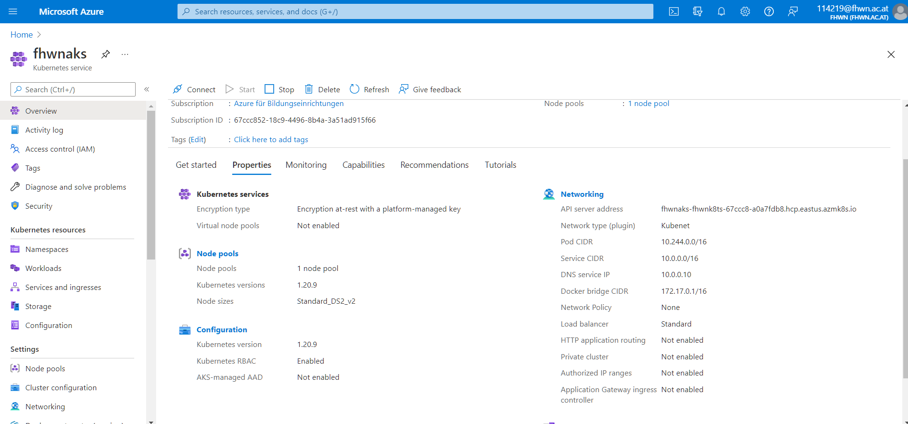
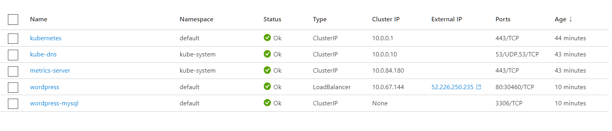
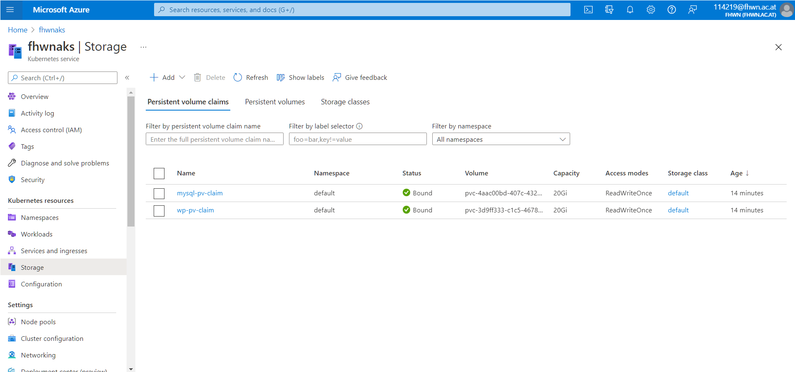
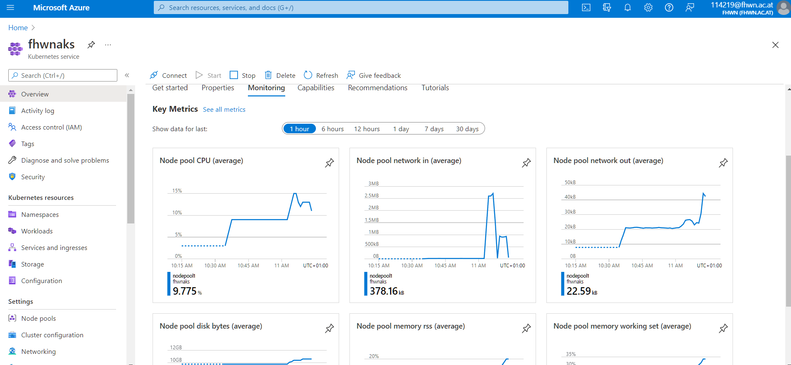
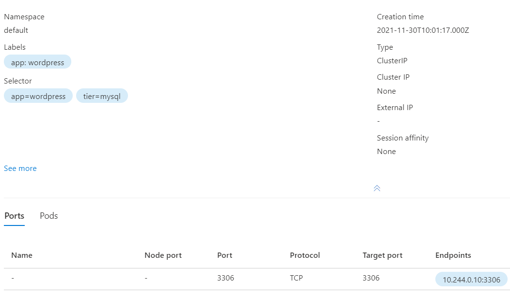
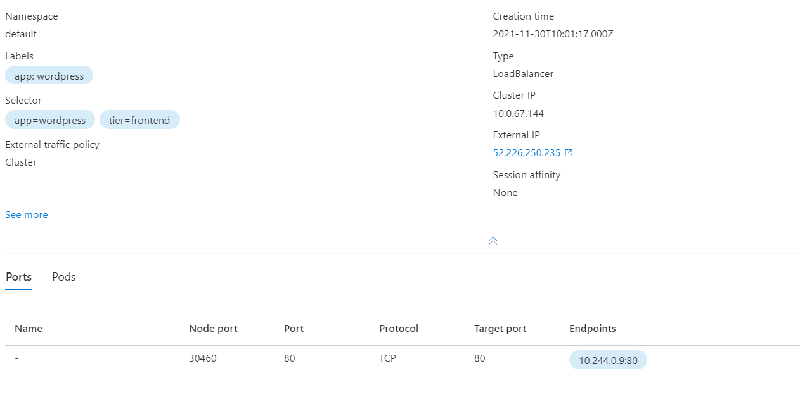
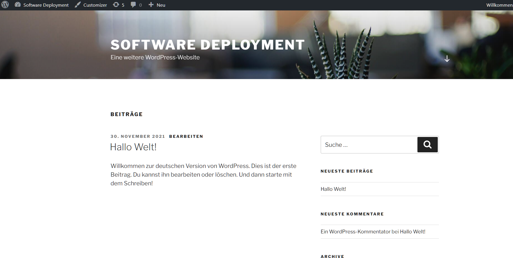

# Lab 4

- All mentioned scripts can be found in the `scripts` directory.
- Ip of Wordpress Server: http://52.226.250.235/

## Step 1: Creating K8s Cluster in Azure

- `az group create -n fhwnk8ts --location eastus`
  - Creates a resource group for the cluster
- `az aks create -g fhwnk8ts -n fhwnaks --node-count 1 --generate-ssh-keys`
  - Creates the cluster in the resource group with one node and generated ssh keys
- `az aks get-credentials -g fhwnk8ts -n fhwnaks`
  - Gets the credentials for the cluster

## Step 2: Generating secrets

- To generate a secret for the cluster, a script `kustomization.yaml` has to be created.
- This file contains the instructions for the secret generator:

```
secretGenerator:
  - name: mysql-password
    literals:
      - password=YOUR_PASS
```

- This password will be used by the MySql Service as a root password and the Wordpress Service to access the db.

## Step 3: Configuring Services

Next, the mysql database and the wordpress server need to be configured.

### A) MySQL

- The script `mysql-deployment.yaml` contains the declaration for the database service.
  - A service for the app "wordpress" will be created with tier "mysql".
  - The deployment defines a persistent volume claim to persist the db data.
  - Port 3306 is exposed to allow database access.
  - The image mysql:5.6 is used to host the database.
  - The root password is set to use the secret we generated earlier.
  - The volume is bound to a path.
- The entire deployment can be found in the script file.

### B) Wordpress

- The script `wordpress-deployment.yaml` contains the declaration for the wordpress service.
  - A service for the app "wordpress" will be created with tier "frontend".
  - The deployment defines a persistent volume claim to persist the wordpress content.
  - Port 80 is exposed to give users access to the website.
  - The image wordpress:4.8-apache is used to host the website.
  - The ENVs are configured to enable access to the MySQL database we configured before.
- The entire deployment can be found in the script file.

### C) Kustomization

- In the script `kustomization.yaml` we add the other scripts as resources:

```
resources:
  - mysql-deployment.yaml
  - wordpress-deployment.yaml
```

- This way we can easily deploy the entire structure.

## Step 4: Deployment

- In order to deploy the configuration we need to use kubectl.
- By running `kubectl apply -k ./` we can apply the configuration to the cluster.
- This will take a while to process, but after this step we are basically done.

## Step 5: Verifying

- To verify that everything works we can inspect the cluster.
- By running `kubectl get pvc` we can ensure that the volumes were created.
- By running `kubectl get pods` we can ensure that our pods are up and running.
  - This can take some time until the pods are in the correct status.
- By running `kubectl get services wordpress` we can get some detail info on the wordpress process.
  - We can also see our external IP here.
- Finally, we can check out the website to ensure that it is working.

  - The IP is http://52.226.250.235/

# Images

## Cluster Properties



## Cluster Services



## Cluster Volumes



## Cluster Metrics



## MySQL Service



## Wordpress Service



## Webpage


